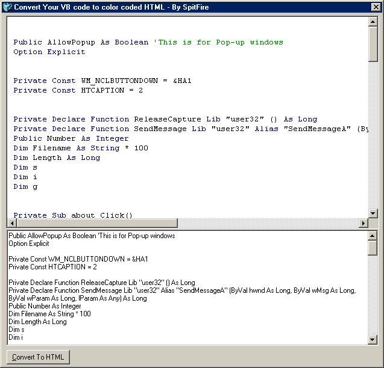



## Convert Your VB code to color coded HTML

### Description

This code will convert VB code to HTML so you can put it on a website and it will look just like it does in VB! Please Rate!
 
### More Info
 

             |
---                |---
**Submitted On**   |2002-10-12 21:23:12
**By**             |[Jesse Seidel \(Dr\. Fire\)](https://github.com/Planet-Source-Code/PSCIndex/blob/master/ByAuthor/jesse-seidel-dr-fire.md)
**Level**          |Intermediate
**User Rating**    |4.8 (53 globes from 11 users)
**Compatibility**  |VB 6\.0
**Category**       |[Internet/ HTML](https://github.com/Planet-Source-Code/PSCIndex/blob/master/ByCategory/internet-html__1-34.md)
**World**          |[Visual Basic](https://github.com/Planet-Source-Code/PSCIndex/blob/master/ByWorld/visual-basic.md)
**Archive File**   |[Convert\_Yo14530910132002\.zip](https://github.com/Planet-Source-Code/jesse-seidel-dr-fire-convert-your-vb-code-to-color-coded-html__1-39773/archive/master.zip)

